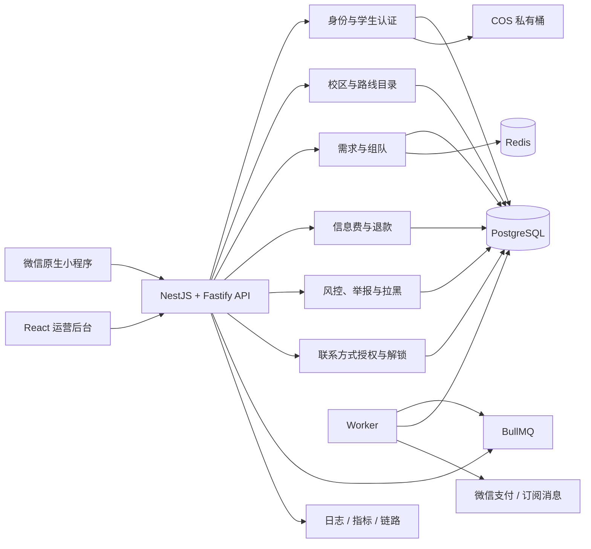

# 系统架构总览

## 1. 目标与边界

系统向已认证学生提供同路线乘客信息撮合。系统的服务完成点是：当前有效成员均已确认、支付信息服务费并同意共享后，平台成功向组内成员解锁微信号。

系统绝不提供或保存以下能力：司机招募、车辆、派车、代叫车、运价、实际车费、运输分账、实时车辆轨迹、运输保险或保证送达。后续需求若涉及这些概念，必须新建架构决策并进行法律评估，不得直接加入现有模型。

## 2. 逻辑架构

## 3. 模块边界

| 模块 | 拥有的数据 | 对外能力 | 禁止承担 |
|---|---|---|---|
| Identity | User、Session、Contact | 微信登录、会话、注销 | 组队和付款状态 |
| Verification | StudentVerification、Asset、AssetAccessGrant | 无损认证状态、申请/补交、审核、平台代理材料、删除 | 长期保存证件原图或向客户端暴露COS URL |
| Catalog | Campus、Place、Route、Schedule | 固定路线与时间窗 | 自由地点和实时定位 |
| Demand | TravelDemand | 发布、撤销、查询 | 创建可信付款金额 |
| Grouping | Group、Member、FormationRound、Confirmation | 加入、离开、确认、状态流转 | 直接处理外部支付 |
| Payment | ServiceOrder、Transaction、Refund | 计价、预支付、回调、退款、对账 | 相信客户端付款结果 |
| Contact | Consent、Unlock、AccessLog | 授权、撤回、加密存储、整组解锁与带披露集合摘要的逐次审计 | 解锁前、任一撤回后或部分过滤时返回微信号 |
| Trust | Block、Report、RiskEvent | 限流、拦截、申诉 | 静默永久封禁 |
| Operations | Admin、Role、AuditLog | 审核、配置、处置 | 无审计修改敏感数据 |
| Notification | Notification、OutboxEvent | 站内/订阅通知 | 将通知成功视为业务成功 |

模块通过应用服务接口和领域事件协作。首版部署为模块化单体，但禁止跨模块直接修改对方表；未来可按模块拆服务而不改变外部契约。

## 4. 数据与一致性

- PostgreSQL 是唯一事实源；Redis 只用于限流、短锁、缓存和队列，不决定最终业务状态。
- 加入、离开、确认、支付落账和解锁使用数据库事务及乐观版本号；容量检查必须在事务内完成。
- 外部调用使用 transactional outbox：先在同一事务写业务状态和 OutboxEvent，再由 Worker 投递。
- 客户端发起的业务写操作要求 `Idempotency-Key`。键与认证主体、operationId 和规范化请求摘要绑定，保留 24 小时；同键不同摘要返回 `409 IDEMPOTENCY_CONFLICT`。
- 登录使用一次性微信 code；刷新使用单次轮换的 Refresh Token family，并发刷新只允许一个请求成功；登出重复执行安全收敛到已撤销状态。这些认证操作不使用客户端业务幂等键。
- 支付/退款回调按通知 ID、平台事务号、商户订单号和密文摘要幂等，并只允许状态单调前进；外部回调不接受调用方自定义 `Idempotency-Key`。
- 材料访问凭证采用单次消费语义而非业务幂等：原文只进入专用请求头，数据库按凭证摘要与管理员会话原子写 `usedAt`；任何重放不得返回首次材料响应。
- 金额使用整数分。首发规则 `SERVICE_FEE_PER_ACCOUNT_FEN = 99` 由服务端配置版本决定并快照到订单。
- 联系方式应用层信封加密；密文、密钥版本和校验摘要分开保存，明文不得出现在日志和审计详情中。

## 5. 身份与授权

- 小程序：`wx.login` code 仅发送一次到 API；API 向微信服务端换取身份并签发短 Access Token 和可轮换 Refresh Token。
- 用户所有组队写操作必须同时通过会话、学生认证、账号状态、校区权限、风控和资源归属检查。
- 运营后台使用独立管理员账号、Argon2id 密码哈希、TOTP、RBAC、短会话和敏感操作再认证。
- 管理员会话使用 `__Host-admin_session` Cookie（`Secure; HttpOnly; SameSite=Strict; Path=/`），CSRF Token 与会话绑定并在登录、权限提升和主动轮换时更新。所有状态变更同时校验可信 Origin、CSRF、最小角色和校区作用域。
- 审核元数据不包含材料地址。查看材料必须先以 TOTP 再认证换取绑定管理员会话、校区、申请和对象、最长60秒的单次访问凭证，再经平台受控代理原子消费；API 不重定向且不返回 COS URL，签发、使用、过期和拒绝均写追加式审计。
- 资源归属失败默认返回防枚举 `404`；无会话返回 `401`；已定位到资源但角色、校区、CSRF 或再认证不满足时返回 `403`；状态冲突返回 `409`。
- 后台与用户端使用不同签发者、密钥、Cookie/Token 和路由前缀，防止权限混用。

## 6. 部署拓扑

- 本地：Docker Compose 提供 PostgreSQL、Redis 与模拟对象存储；微信登录、支付和消息均走模拟适配器。
- 预发布/生产：腾讯云广州，API/Worker 容器、TencentDB PostgreSQL、Redis、COS 私有桶、KMS、CLB 和 WAF。
- 环境完全隔离数据库、商户配置、密钥和小程序版本。生产不得回退到模拟支付。
- 目标 RPO 15 分钟、RTO 2 小时；数据库时间点恢复、COS 生命周期和备份恢复必须在 M6 演练。
