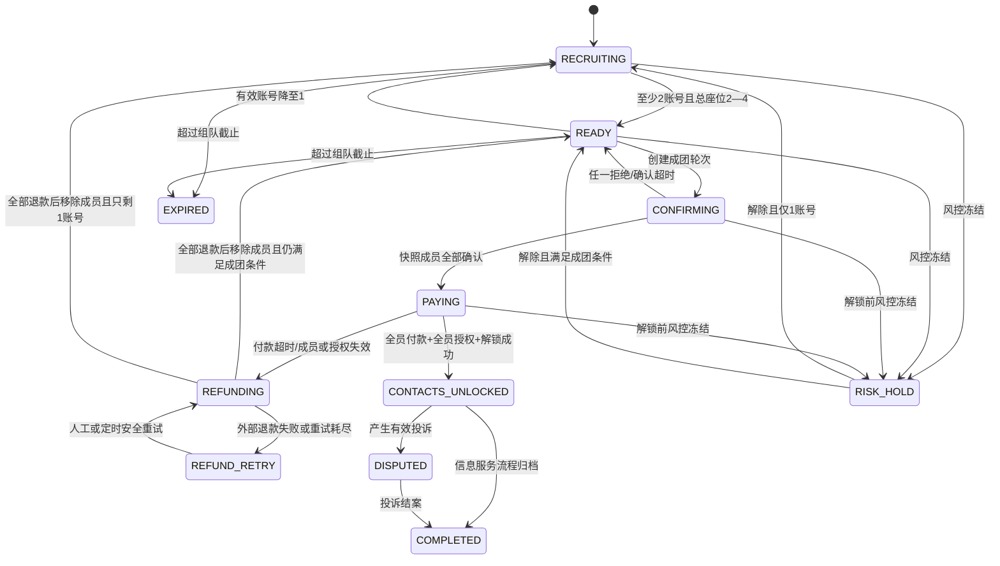
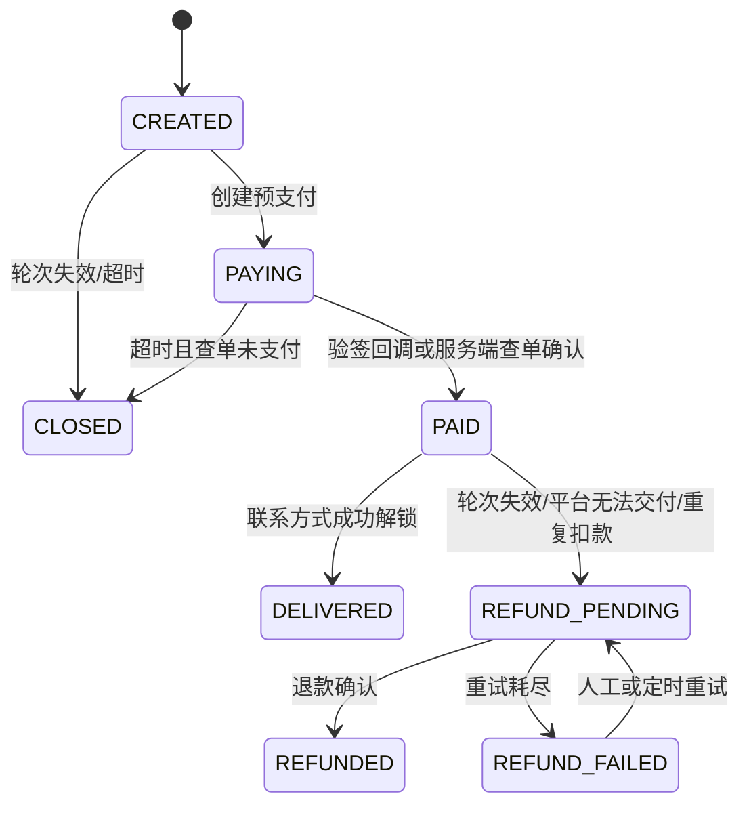

# 领域模型与状态机

除全局政策、角色和管理员主体外，所有校区所属的核心与从属记录均显式保存
`campusId`。从属记录还通过迁移中的复合外键与父记录校区绑定，不能只依赖应用层过滤。

## 1. 统一术语

- **账号数**：组内不同且有效的认证 User 数量。
- **座位数**：所有有效 GroupMember.seatCount 之和，范围 1—4。
- **成团条件**：账号数至少 2，座位数为 2—4，成员认证/风控/偏好均兼容。
- **成团轮次**：针对一个不可变成员快照发起的一轮确认和付款。
- **信息服务完成**：该轮全员付款、共享同意有效并成功解锁联系方式。
- **同行完成**：只表示平台流程归档，不表示运输完成或安全到达。

## 2. 聚合与关键字段

### 身份与认证

| 实体 | 关键字段 | 约束 |
|---|---|---|
| User | id、wechatSubject、campusId、status、genderDeclaration | 微信主体唯一；性别不在大厅展示 |
| UserSession | id、userId、refreshTokenHash、expiresAt、revokedAt | 只存刷新令牌哈希，可逐会话撤销 |
| UserContact | userId、wechatIdCiphertext、keyVersion、updatedAt | 应用层加密，读取必须经过授权服务 |
| StudentVerification | id、userId、campusId、studentNoDigest、last4、status、submittedAt、latestSubmittedAt、reviewedAt、expiresAt | 同校区学号摘要唯一；不存完整学号；首次提交时间不可清空；所有通过认证均有明确有效期，不允许永久认证 |
| VerificationAsset | id、verificationId、objectKey、uploadExpiresAt、deleteAfter、deletedAt | 私有对象；上传凭证过期即不可提交；审核后 24 小时删除 |

### 路线与组队

| 实体 | 关键字段 | 约束 |
|---|---|---|
| Campus | id、name、status | 所有业务对象按 campusId 隔离 |
| Place | id、campusId、name、type、status | 固定校门/交通枢纽，不接受用户自由输入 |
| Route | id、campusId、originId、destinationId、status | 方向有序；往返是两条 Route |
| RouteSchedule | id、routeId、weekday、start/end、windowMinutes | 首发默认 30 分钟窗口 |
| TravelDemand | id、userId、routeId、windowStart/end、seatCount、preference、status | seatCount 1—3；时间窗合法且未过期 |
| CompanionGroup | id、campusId、routeId、windowStart/end、state、version | 乐观锁 version；状态只能由领域服务改变 |
| GroupMember | id、groupId、userId、demandId、seatCount、status、joinedAt | 同组 userId 唯一；有效座位合计 ≤4 |
| FormationRound | id、groupId、memberSnapshotHash、contactPolicyVersionId、state、confirmBy、payBy | 成员集合与共享政策版本不可变；同组仅一个活动轮次 |
| MemberConfirmation | roundId、userId、decision、decidedAt | 快照成员每人一条且不可覆盖历史 |

### 付款、联系与治理

| 实体 | 关键字段 | 约束 |
|---|---|---|
| ServiceOrder | id、roundId、userId、amountFen、pricingVersion、status | 每轮每账号一个有效订单，金额固定 99 分 |
| PaymentTransaction | id、orderId、provider、providerTxnId、status、rawDigest | providerTxnId 唯一；不保存敏感回调原文 |
| Refund | id、orderId、amountFen、reason、status、providerRefundId | 不得超过实付金额；状态幂等 |
| ContactConsent | roundId、userId、policyVersion、grantedAt、revokedAt | 版本必须等于本轮锁定版本；解锁时仍有效；成员变化即作废 |
| ContactUnlock | id、roundId、viewerId、subjectId、unlockedAt | 一次性交付资格事实；逐查看者/被查看者唯一且不可更新 |
| ContactAccessLog | id、roundId、viewerId、policyVersionId、subjectSetDigest/count、requestId、outcome、accessedAt | 每次读取追加一条；成功记录规范化被披露账号集合摘要和数量，不保存账号列表或微信号 |
| BlockRelation | blockerId、blockedId、createdAt | 双方不得进入同一新组 |
| Report | id、reporterId、subjectUserId/groupId、category、status | 举报人必须与事件存在合法关联 |
| RiskEvent | id、userId、ruleCode、evidenceDigest、decision、expiresAt | 规则版本化、可申诉、禁止写入敏感明文 |
| Notification | id、userId、type、status、sentAt | 通知失败不回滚业务事务 |
| OutboxEvent | id、aggregateType/id、eventType、payload、status | 业务事务内创建，消费者幂等 |
| AdminUser/Role | id、status、passwordHash、totpSecretCiphertext、roles | 与学生账号体系完全隔离 |
| AdminSession | id、adminUserId、sessionTokenHash、csrfTokenHash、expiresAt、reauthenticatedAt | 短会话；令牌仅保存摘要；可逐会话撤销 |
| VerificationAssetAccessGrant | id、verificationId、adminUserId、adminSessionId、tokenDigest、expiresAt、usedAt | TOTP 再认证后签发；最长60秒、单次、绑定对象/管理员/会话/校区；只经平台代理原子消费 |
| AuditLog | id、actor、action、target、before/afterDigest、createdAt | 追加写；敏感值只保存摘要 |
| SystemConfig | key、campusId、version、value、effectiveAt | 价格、时限、限流均版本化 |
| PolicyVersion | type、version、contentDigest、effectiveAt | 同意记录引用不可变版本 |

## 3. 组队状态机



终态为 `COMPLETED`、`EXPIRED`。`DISPUTED` 是解锁后的处置态；`RISK_HOLD` 是解锁前的暂停态；`REFUNDING` 和 `REFUND_RETRY` 是不可加入、不可离开、不可创建新轮/订单、不可解锁和不可读取联系方式的财务补偿态。不存在 `IN_TRANSIT`、`ARRIVED` 或任何运输状态。

### Group 与 FormationRound 状态映射

| FormationRound 状态 | 允许的 Group 状态 | 允许操作 |
|---|---|---|
| `CONFIRMING` | `CONFIRMING` | 快照成员确认/拒绝；禁止成员变化和下单 |
| `PAYING` | `PAYING` | 当前快照成员创建/查询订单；禁止成员变化 |
| `DELIVERED` | `CONTACTS_UNLOCKED` 或 `COMPLETED` | 仅在同意未撤回时读取；可投诉 |
| `REFUNDING` | `REFUNDING` | 仅退款处理、查单和内部审计 |
| `REFUND_RETRY` | `REFUND_RETRY` | 仅受控退款重试、查单和人工处置 |
| `INVALIDATED` | `READY`、`RECRUITING`、`EXPIRED` 或 `RISK_HOLD` | 旧轮不可再确认、下单、付款或读取 |

## 4. 成团轮次状态机

```text
CONFIRMING
  ├─ 全员 ACCEPT → PAYING
  ├─ 任一 DECLINE → INVALIDATED
  └─ confirmBy 到期 → INVALIDATED

PAYING
  ├─ 全员 PAID 且同意有效 → DELIVERED
  ├─ payBy 到期 → REFUNDING
  └─ 成员/认证/风控/授权变化 → REFUNDING

REFUNDING
  ├─ 所有已付款订单退款完成 → INVALIDATED
  └─ 外部失败 → REFUND_RETRY（组保持不可解锁）
```

付款超时或解锁前授权撤回的首个事务固定执行：冻结解锁 → 将 Group 和轮次置为 `REFUNDING` → 关闭未付款订单 → 为已付款订单创建全额退款任务。退款完成前保留成员快照，禁止加入、离开、新轮、下单和联系方式读取。所有退款成功后，才在一个事务中标记轮次 `INVALIDATED`、移除应移除成员并重算 Group 为 `READY` 或 `RECRUITING`。退款失败保持 `REFUND_RETRY`，不得恢复招募或沿用旧付款。

## 5. 学生认证状态机

```text
AWAITING_UPLOAD
  ├─ 上传凭证有效且对象 HEAD/摘要/大小/类型通过 → PENDING（原子写 submittedAt 和 latestSubmittedAt）
  ├─ 上传凭证过期/对象无效 → UPLOAD_EXPIRED（submittedAt 仍为空；对象不可读并进入删除）
  └─ 用户重新创建 → 旧对象失效并进入删除，新申请仍为 AWAITING_UPLOAD

PENDING
  ├─ 审核通过 → VERIFIED（按校区认证政策写入非空 expiresAt）
  ├─ 审核拒绝 → REJECTED
  └─ 需要补交 → REQUIRE_RESUBMISSION（旧对象立即失效并进入删除）

REQUIRE_RESUBMISSION
  └─ 创建新上传凭证 → RESUBMISSION_AWAITING_UPLOAD（保留原 submittedAt/latestSubmittedAt/reviewedAt）

RESUBMISSION_AWAITING_UPLOAD
  ├─ 新对象校验通过 → RESUBMISSION_PENDING（只推进 latestSubmittedAt）
  └─ 凭证过期/对象无效 → REQUIRE_RESUBMISSION（保留全部历史时间）

RESUBMISSION_PENDING
  ├─ 审核通过 → VERIFIED（按校区认证政策重新写入非空 expiresAt）
  ├─ 审核拒绝 → REJECTED
  └─ 仍需补交 → REQUIRE_RESUBMISSION

VERIFIED
  └─ 当前时间达到 expiresAt → VERIFICATION_EXPIRED（保留全部历史时间和 expiresAt）
```

`AWAITING_UPLOAD` 与 `UPLOAD_EXPIRED` 从未提交，三个历史时间字段和 `expiresAt` 均为空；`PENDING` 是首次提交且 `reviewedAt/expiresAt` 为空；拒绝、要求补交及补交中状态的 `expiresAt` 为空。`VERIFIED` 与 `VERIFICATION_EXPIRED` 必须保存非空 `expiresAt`，且 `expiresAt > reviewedAt`。不支持永久认证。核心操作的授权判断固定为 `status = VERIFIED AND expiresAt > transactionNow`；刚好到期即无权限，不能等待异步任务修正状态后才拒绝。过期任务仅条件更新 `VERIFIED AND expiresAt <= cutoff`，重复执行或旧任务乱序执行不得恢复已过期状态。数据库 CHECK 必须拒绝任何状态—时间矛盾。材料 URL/对象键不出现在普通状态响应。

管理员材料访问先由 TOTP 再认证接口签发高熵凭证，数据库只保存摘要。客户端把原始凭证放入专用请求头调用平台代理端点 `consumeVerificationAssetGrant`；平台在同一数据库事务中以摘要、管理员会话、校区、申请、未过期、`usedAt IS NULL` 和对象未删除为条件更新 `usedAt` 并追加审计。条件更新未命中即统一拒绝。代理读取中途失败也不恢复原凭证，必须重新认证签发；任何响应不得重定向或暴露 COS URL。

## 6. 订单状态机



客户端支付成功回调不能直接触发 `PAID`。退款完成前不得删除订单、交易或审计证据。

## 7. 联系方式同意、交付与撤回

- 创建成团轮次时同时锁定 `memberSnapshotHash` 与 `contactPolicyVersionId`。`ACCEPT` 必须提交 `granted=true` 和完全相同的政策版本；缺失或不匹配一律拒绝。
- `DECLINE` 不创建有效同意。成员快照、政策版本或轮次变化使旧同意不可用于交付。
- `ContactUnlock` 只证明某查看者对某被查看者曾取得交付资格；每次 GET 联系方式都新写 `ContactAccessLog`，重复读取不得覆盖旧日志。成功日志锁定政策版本，并保存规范化被披露账号 ID 有序集合的 SHA-256 摘要和数量。
- 解锁前撤回（包括已付款但尚未解锁）会触发本轮全额退款补偿；解锁后撤回立即阻止该用户作为查看者或被查看者的所有后续读取。已展示的明文无法技术性收回，必须在政策和 UI 明示。
- 联系方式读取采用整组全有或全无（`all-or-nothing`）语义：任何锁定成员撤回后，所有成员的新读取整体拒绝，不得过滤成员后返回部分联系人。被拒绝读取写 `ContactAccessLog(outcome=DENIED)`，披露摘要为空且数量为0。

## 8. 核心不变量

标识 `INV-*` 将被测试名、错误码和验证报告引用。

| 编号 | 不变量 |
|---|---|
| INV-001 | 组内有效座位合计始终为 1—4；任何并发请求均不能产生第 5 座 |
| INV-002 | `READY`、`CONFIRMING`、`PAYING`、`CONTACTS_UNLOCKED`、`COMPLETED`、`DISPUTED` 至少包含两个不同有效认证账号；退款补偿态不代表有效成团且不得开放业务操作 |
| INV-003 | 同一用户不能同时加入时间重叠的两个活动组 |
| INV-004 | 仅 `VERIFIED`、`expiresAt` 非空且严格晚于当前数据库事务时间、未受限用户可发布、加入、确认和付款；刚好到期即拒绝 |
| INV-005 | 同性偏好必须对当前全部成员对称兼容；未知性别不能进入仅同性组 |
| INV-006 | FormationRound 的成员快照创建后不可变；成员变化必须使其失效 |
| INV-007 | 每个轮次每个账号最多一个可支付 ServiceOrder，金额必须为服务端规则快照 |
| INV-008 | 只有全员 PAID、同意政策版本与成员快照均有效、轮次未失效时才能写 ContactUnlock；退款态禁止解锁 |
| INV-009 | 只有当前轮次且全体同意未撤回时才能整组读取联系方式；每次读取均追加带政策版本和披露集合摘要的独立 ContactAccessLog，不允许部分披露 |
| INV-010 | 支付和退款回调重复或乱序不能重复入账、重复退款或回退终态 |
| INV-011 | 认证原图到达删除期限后不可再被 API 或管理员读取 |
| INV-012 | 校区运营角色不能读取或修改未授权校区的数据 |
| INV-013 | 联系方式、令牌、学生材料地址和支付秘密不得进入日志、错误或审计明文 |
| INV-014 | 领域模型不得出现司机、车辆、运价、实际车费或运输履约字段 |

学号只在创建认证请求的服务端内存中短暂出现，用于计算带校区域分离的 HMAC 摘要和后四位；客户端不能单独提交后四位，数据库、队列、日志和审计均不得保存完整学号。

## 9. 主要领域事件

`DemandPublished`、`MemberJoined`、`MemberLeft`、`GroupBecameReady`、`FormationStarted`、`MemberConfirmed`、`ContactConsentRevoked`、`RoundPaymentOpened`、`OrderPaid`、`RoundRefundRequired`、`RefundRetryScheduled`、`RefundSucceeded`、`ContactsUnlocked`、`ContactAccessed`、`GroupExpired`、`VerificationUploadExpired`、`VerificationResubmissionRequested`、`VerificationResubmitted`、`VerificationCredentialExpired`、`VerificationReviewed`、`VerificationAssetDeletionDue`、`AdminAssetGrantIssued`、`AdminAssetGrantConsumed`、`RiskHoldPlaced`、`ReportCreated`。

领域事件只陈述已提交事实；通知、支付外呼和删除对象等副作用由 Outbox Worker 执行。
