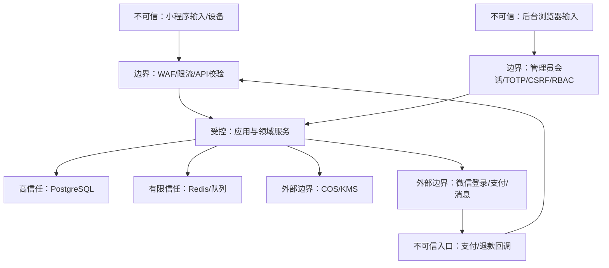

# 威胁模型（M0）

## 1. 保护目标

优先级从高到低：

1. 未解锁的微信号、学生认证材料、学号摘要和出行时间路线不得泄露。
2. 不允许伪造学生身份、组成员、付款、退款、共享同意或管理员权限。
3. 并发和重试不能导致第 5 座、重复扣款、重复退款或错误解锁。
4. 认证、组队、付款、解锁、审核与退款必须可以审计和恢复。
5. 平台边界不得被扩展为司机、车辆或运输组织系统。

## 2. 信任边界

小程序、浏览器、HTTP 头、Redis 缓存、队列消息和外部回调均不能直接证明业务事实。只有通过校验并提交到 PostgreSQL 的状态才可信。

## 3. 主要威胁与控制

| 编号 | 威胁 | 影响 | 必须控制 | 验证方式 |
|---|---|---|---|---|
| T-001 | 枚举 groupId/userId、撤回后读取或部分披露微信号 | 联系方式泄露/披露范围不明 | 资源归属、当前轮次成员、全员付款、锁定政策版本和全员未撤回检查；整组全有或全无；成功审计记录被披露集合摘要与数量 | IDOR/撤回负向测试；随机 UUID 扫描；重复读取和披露摘要测试 |
| T-002 | 客户端伪造金额或 PAID | 少付/免费解锁 | DTO 不含金额；服务端计价；只信验签回调/查单 | 契约检查；伪造回调测试 |
| T-003 | 重复或乱序支付回调 | 重复入账/状态回退 | providerTxnId 唯一、状态单调、事务幂等 | 随机顺序重放至少 20 轮 |
| T-004 | 并发加入导致第 5 座 | 容量和安全失败 | 行锁/乐观版本、事务内重新汇总、数据库约束 | 并发加入测试至少 20 轮 |
| T-005 | 付款后替换成员 | 未经同意共享给陌生人 | 不可变成员快照；任何变化使轮次失效并退款 | 状态机属性测试 |
| T-006 | 伪造/重复学生认证 | 非学生进入、骚扰 | 学号 HMAC 唯一、人工审核、设备/账号异常复核 | 重复摘要和越校区测试 |
| T-007 | 认证材料长期暴露或单次凭证可重放 | 特定身份泄露 | 无损认证状态、私有桶、对象校验、管理员 TOTP 再认证、最长60秒会话绑定凭证、数据库原子消费、平台代理且不暴露COS URL、审核后删除、读取审计 | 状态—时间负向测试；并发兑换、过期/错会话/错校区/重放测试 |
| T-008 | 日志泄露 code/token/微信号 | 批量泄露 | 字段白名单、递归脱敏、禁止记录 body 原文 | Canary 秘密扫描日志 |
| T-009 | 管理员账号或材料凭证被盗 | 跨校区数据和退款滥用 | Argon2id、TOTP、RBAC、短会话、敏感动作再认证、凭证绑定签发会话/校区、原子单次消费、操作级最小角色、追加审计 | 权限矩阵、会话固定、并发兑换和材料凭证重放测试 |
| T-010 | CSRF 操作后台 | 未授权审核/退款 | `__Host-` + SameSite=Strict/HttpOnly/Secure Cookie、可信 Origin/Fetch Metadata、会话绑定且轮换的 CSRF token | 跨站、旧 Token 和缺失 Origin 负向测试 |
| T-011 | 恶意占位不付款 | 匹配池不可用 | 5分钟确认/付款时限、频率限制、信用事件 | 时钟驱动测试；重复超时测试 |
| T-012 | 按性别批量获取联系方式 | 骚扰和隐私伤害 | 认证门槛、每日解锁限制、异常模式风控、举报冻结 | 行为规则测试 |
| T-013 | Outbox 重复投递 | 重复消息/退款 | 消费幂等键、业务唯一约束、可重放事件 | 重复消费测试 |
| T-014 | 校区权限穿透 | 跨校区泄露 | campusId 数据域 + RBAC 范围 + 查询强制过滤 | 全后台接口跨校区测试 |
| T-015 | SSRF/恶意对象键 | 内网访问或覆盖材料 | 服务端生成 objectKey；COS 域名白名单；不抓用户 URL | 输入和对象键测试 |
| T-016 | 依赖/密钥供应链泄露 | 全系统失陷 | 锁文件、依赖扫描、密钥扫描、最小镜像、SBOM | CI 阻断 |
| T-017 | 通过产品演进接入私人车主 | 监管与人身风险 | 领域词汇禁用扫描、ADR 审核、无运输实体 | Schema/API 禁止词检查 |
| T-018 | 注销后信息继续使用 | 合规和隐私风险 | 删除/匿名化工作流、法定保留隔离、停止业务处理 | 注销 E2E 和数据盘点 |

## 4. 滥用场景

### 联系方式收集者

攻击者认证后频繁加入特定性别的组，以 0.99 元换取微信号。控制包括每日加入/解锁上限、异常偏好模式、不同用户举报、付款工具/设备关联信号、冻结与申诉。不得依赖收费金额本身阻止滥用。

### 恶意占位者

攻击者反复加入、确认但不付款，使正常成员无法组队。超时后移除、轮次失效、信用计分和指数级冷却；已付款者自动退款。不得为了减少退款而沿用旧轮次。

### 内部人员越权

管理员试图浏览认证材料、导出路线和联系方式或批准异常退款。后台默认不提供联系方式批量导出；审核列表只返回脱敏元数据。单次材料查看必须以 TOTP 再认证换取绑定管理员、校区、申请和对象的短时单次凭证，签发和使用均审计；退款要求 TOTP 再认证；跨校区请求拒绝。

### 用户提供私人车辆

成员可能在线下提出私人车辆接送。产品不提供司机/车辆字段、发布入口或运费分账；举报类别包含不安全行为；安全提示要求通过正规第三方平台叫车。平台不把线下运输状态写入领域模型。

## 5. 隐私和数据生命周期

| 数据 | 分类 | 处理与保留基线 |
|---|---|---|
| 微信主体标识 | 个人信息 | 账号存续期；注销后按规则删除/匿名化 |
| 微信号 | 高敏感业务数据 | 应用层加密；仅当前已解锁成员逐次读取 |
| 学生证/校园卡图像 | 敏感个人信息 | 私有存储；审核决定后24小时删除，最长7天 |
| 学号摘要/后四位 | 特定身份验证数据 | HMAC + 权限隔离；认证有效期和争议必要期 |
| 路线与时间窗 | 潜在行踪信息 | 完成后30天删除精确关联或降精度匿名化 |
| 支付/退款记录 | 财务与争议证据 | 按适用财税和争议期限隔离保留 |
| 举报/风险证据 | 安全数据 | 按严重度和申诉期限保留，禁止无期限默认保存 |
| 审计日志 | 安全证据 | 仅摘要/脱敏内容，追加写和限权访问 |

敏感个人信息需单独同意、明确用途和影响，并提供访问、更正、删除、撤回授权和注销入口。解锁前撤回会阻止交付并进入本轮退款；解锁后任一成员撤回会阻止整组后续读取，平台不返回过滤后的部分联系人，但已向其他成员展示的明文无法技术性收回。正式上线前由专业人员根据当时有效法律、微信平台规则和实际主体审阅。

固定路线、校门、交通枢纽和已启用的聚合时间窗属于公开低敏感目录，可供未登录用户浏览；公开响应不得包含组、需求、用户、实时人数或个体出行关联。组列表、需求和组详情仍要求用户会话及相应权限。

## 6. 上线阻断条件

- 任一未付款、非成员或跨校区读取联系方式路径存在。
- 支付/退款回调验签、幂等或对账未完成。
- 认证材料删除不可证明，或管理员可以获得永久对象 URL。
- 上传前过期、补交或资格到期状态需要清空历史提交/审核时间才能满足契约。
- 材料访问绕过平台代理、凭证寿命超过60秒、未绑定会话/校区，或并发兑换可成功两次。
- 退款补偿期间仍可加入、离开、创建新轮/订单或读取联系方式。
- 联系方式共享政策版本不匹配仍可确认，或撤回后仍能产生新读取。
- 联系方式读取可以在成员撤回后部分返回，或成功审计无法证明本次披露范围。
- 日志、错误或监控中出现真实 token、微信号、证件 URL 或密钥。
- 出现司机、车辆、运价、实际车费、派车或运输承诺字段。
- P0/P1 缺陷、严重依赖漏洞或未解决的高风险威胁仍存在。
